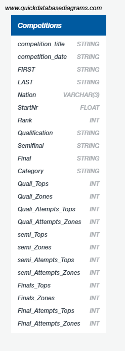

# Bouldering Competition — Likelihood to Win by Nation

> **Note:** This project is being actively reworked to predict IFSC World Cup bouldering results. The current models and findings below reflect the original group project (2023).

## Project Overview


Bouldering is a demanding sport requiring strength, endurance, and mental agility. This project uses IFSC competition results to build machine learning models that predict which nations are most likely to produce finalists and winners in bouldering competitions.

## Data Source

[IFSC Sport Climbing Competition Results](https://www.kaggle.com/datasets/brkurzawa/ifsc-sport-climbing-competition-results) via Kaggle.

## Data Pipeline


## Repository Structure

```
├── ETL/                        # Data cleaning and preparation
├── Database/                   # SQLite database and integration notebook
├── Machine_Learning/           # Model notebooks (neural network + random forest)
├── Visualization/              # Tableau exports
├── Images/                     # Diagrams and screenshots
└── Final Presentation/         # Project presentation slides
```

## Setup

### Prerequisites

- Python 3.10+
- See `requirements.txt` for package dependencies

```bash
pip install -r requirements.txt
```

## Machine Learning Models

Two model approaches were explored:

### Deep Neural Network


### Random Forest


## Database (ERD)



## Visualization


## Findings

The random forest model achieved >85% accuracy predicting whether a competitor would reach the finals. Feature importance analysis highlighted athletes from France and Japan as having the highest statistical likelihood of reaching finals — relevant for brand ambassador selection.

## Limitations

- Dataset lacks individual athlete attributes beyond competition results
- Some high-importance features don't have intuitive explanations; removing them reduces accuracy

## Contributors

David Chartrand, Gilaine Soares, Aditi Bindlish, Chu Nguyen Kien
